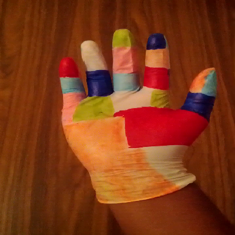
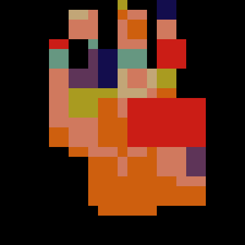
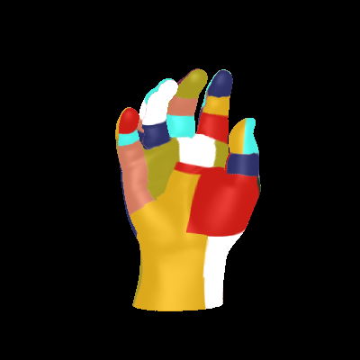

gloveTrack
==========

<a href="docs/images/actual_webcam_frame.png"></a>
<a href="docs/images/actual_normalized_frame.png"></a>
<a href="hypothetical_match.png"></a>

gloveTrack is a free, libre and open source hand tracking system intended for (eventual) use with Virtual Reality headsets.

gloveTrack lets your hands enter computer games (and other 3D rendered environments) to interact with objects, requiring only common household items for this to occur: a camera, latex gloves and some colored whiteboard markers.

gloveTrack is an implementation of most of the techniques described in Robert Y. Yang's 2009 research paper ["Real-Time Hand-Tracking with a Color Glove"](http://people.csail.mit.edu/rywang/handtracking/s09-hand-tracking.pdf).

Contributions are highly welcome.

### Physical dependencies
- Video source with accurate color representation (most webcams should be fine, or smartphone connected as USB camera)
- Colored gloves 
- Moderately powerful PC (future optimization will allow lower spec computers such as smartphones to run gloveTrack)

### Sofware dependencies
gloveTrack was developed against software dependencies
- C++11 compiler
- [OpenCV](https://en.wikipedia.org/wiki/OpenCV) (Open Source Computer Vision) v2.4.9
- CMake v2.8 (v3.4 on Windows)
- [LibHand](https://github.com/libhand/libhand) v0.9 by Marin Saric (supplied as git submodule), which was initially developed against
	- [OpenCV](https://en.wikipedia.org/wiki/OpenCV) (Open Source Computer Vision) v2.3.y
	- [OGRE](https://en.wikipedia.org/wiki/OGRE) (Object Orientated Graphics Rendering Engine) v1.7.4
		- OpenGL headers (GL/glu.h)
	- [Tcl/Tk](https://en.wikipedia.org/wiki/Tcl) (likely v8.5.y)
	- [CMake](https://en.wikipedia.org/wiki/CMake) v2.8.6
- Git Large File Storage (LFS) v1.5.5

#### Satisfying software dependencies under Debian/Ubuntu
```bash
sudo apt-get install build-essential cmake git libogre-dev libglu1-mesa-dev libxt-dev libopencv-dev tcl tk
```

On Ubuntu 16.04, substitute libogre-dev with libogre-1.9-dev.

Additionally, [Git LFS](https://github.com/git-lfs/git-lfs/wiki/Installation) must be installed to retrieve the developmental image and video sets from the 'db' submodule.

### Compiling:
```bash
git clone https://github.com/[user]/gloveTrack.git
cd gloveTrack
git submodule init
# Download LibHand submodule and 'db' submodule
git submodule update --recursive
# Download db submoudle's ~16MB submodule containing image/video sets via Git LFS
cd db
git lfs fetch
# Git LFS references don't update to large files without this
git lfs pull
cd ..

# Build LibHand (see https://github.com/libhand/libhand for detailed installation instructions) 
cd third-party/libhand/ && mkdir build && cd build/
cmake ..
make
# Collate build artifacts in *local* directory
make install

# Build gloveTrack
cd ../../../
mkdir build
cd build

cmake ..
make
`
```

### Example usage:
All example from root gloveTrack directory.
```bash
# Use saved video as input and enable generation rendering of 3D model search set
./build/src/gloveTrack --display-width=400 --display-height=400 --processing-width=20 --processing-height=20 --pre-crop-width 200 --pre-crop-height 200 --input-video db/evaluationSet/fullFrameVideo.mp4 --generate-search-set

# Use camera as input
./build/src/gloveTrack --display-width=200 --display-height=200 --processing-width=30 --processing-height=30

# Use saved video as input
 ./build/src/gloveTrack --display-width=400 --display-height=400 --processing-width=20 --processing-height=20 --pre-crop-width 200 --pre-crop-height 200 --input-video db/evaluationSet/vid.mp4
```
